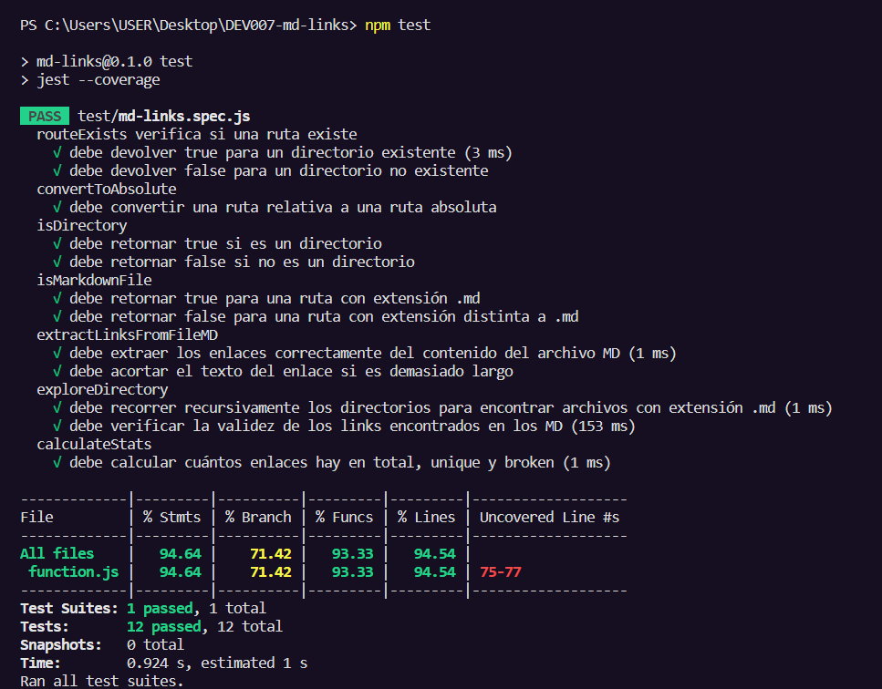

# Markdown Links

## Índice

* [1. Preámbulo](#1-preámbulo)
* [2. Resumen del proyecto](#2-resumen-del-proyecto)
* [3. Instrucciones de uso](#3-instrucciones-de-uso)
* [4. Pruebas unitarias](#4-pruebas-unitarias)
* [5. Diagrama de flujo](#5-diagrama-de-flujo)
* [6. Checklist](#6-checklist)

***

## 1. Preámbulo

[Markdown](https://es.wikipedia.org/wiki/Markdown) es un lenguaje de marcado
ligero muy popular entre developers. Es usado en muchísimas plataformas que
manejan texto plano (GitHub, foros, blogs, ...) y es muy común
encontrar varios archivos en ese formato en cualquier tipo de repositorio
(empezando por el tradicional `README.md`).

Estos archivos `Markdown` normalmente contienen _links_ (vínculos/ligas) que
muchas veces están rotos o ya no son válidos y eso perjudica mucho el valor de
la información que se quiere compartir.

Dentro de una comunidad de código abierto, nos han propuesto crear una
herramienta usando [Node.js](https://nodejs.org/), que lea y analice archivos
en formato `Markdown`, para verificar los links que contengan y reportar
algunas estadísticas.

## 2. Resumen del proyecto

En este proyecto se creó una herramienta de línea de comando (CLI) así como una librería (o biblioteca - library) en JavaScript. Es una herramienta que usando Node.js, permite leer y contabilizar links en archivos Markdown (.md).

## 3. Instrucciones de Uso

### Instalación

Para instalar la biblioteca, ejecuta el siguiente comando en la terminal:

npm i susan-mdlinks

Una vez instalada, la interfaz de línea de comandos (CLI) se ejecuta en la terminal utilizando el siguiente comando:

npx susan-mdlinks <ruta> [opciones]

La 'ruta' representa la ruta del archivo o directorio, la cual puede ser una ruta absoluta o relativa. Mientras que las opciones se refieren a las acciones que desea ejecutar. Estas no son obligatorias, la aplicación sigue siendo funcional con solo proporcionar la ruta. Las opciones posibles son: --validate, --stats, o una combinación de ambas (--validate y --stats).

### Presentación de resultados

- Ruta sin opciones:
Cuando no se pasa ninguna opción, se mostrará solo la información básica de los links.

- Opción: --stats 
Cuando se ejecuta esta opción, el output (salida) mostrará la información sobre la cantidad de links encontrados en los archivos .md y no repetidos (links únicos).

- Opción: -- validate --stats 
Cuando se ejecuta esta opción, la información que mostrará la información sobre la cantidad de links encontrados, cantidad de links únicos (no repetidos) y la cantidad de links rotos (no funcionales).

- Opción: --validate
Cuando se ejecuta esta opción, el módulo hará una petición HTTP para validar si los links encontrados en los archivos Markdown funcionan o no. Por ello, si el link responde ok, entonces consideraremos el link como funcional. Pero si el link responde con fail, entonces consideraremos el link como roto. 

## 4. Pruebas unitarias

Resultados de los test realizados a las funciones.

## 5. Diagrama de flujo

## 6. Checklist
### General

* [ ] Puede instalarse via `npm install --global <github-user>/md-links`

### `README.md`

* [x] Un board con el backlog para la implementación de la librería.
* [x] Documentación técnica de la librería.
* [x] Guía de uso e instalación de la librería

### API `mdLinks(path, opts)`

* [x] El módulo exporta una función con la interfaz (API) esperada.
* [x] Implementa soporte para archivo individual
* [x] Implementa soporte para directorios
* [x] Implementa `options.validate`

### CLI

* [x] Expone ejecutable `md-links` en el path (configurado en `package.json`)
* [x] Se ejecuta sin errores / output esperado
* [x] Implementa `--validate`
* [x] Implementa `--stats`

### Pruebas / tests

* [x] Pruebas unitarias cubren un mínimo del 70% de statements, functions,
  lines, y branches.
* [x] Pasa tests (y linters) (`npm test`).

